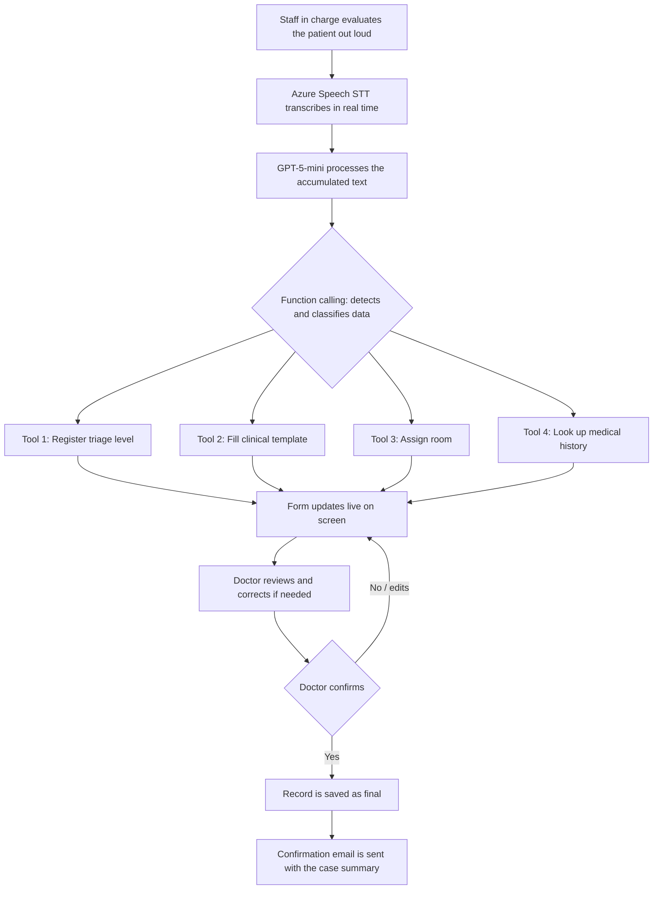

# Centinela

**AI agent that turns lost minutes in emergency triage into saved time — and saved lives.**

---

## 1. The Problem

In emergency medicine, **time is the resource that runs out fastest and matters most**. Clinical literature consistently points to the existence of a "golden hour" in trauma and critical conditions (stroke, cardiac events, severe trauma) — a narrow window where minutes of delay directly correlate with worse outcomes, including higher mortality and irreversible complications.

Right now, that window gets eaten by something entirely preventable: **information friction**.

When a patient arrives by ambulance, the handoff from triage staff to the doctor still happens verbally or on paper. Under time pressure, in a loud, high-stress environment, critical data gets:

- **Forgotten** — a detail mentioned once during triage never makes it into the record.
- **Repeated** — the doctor has to ask the same questions again, re-taking vitals or re-asking about allergies that were already reported.
- **Lost in the handoff** — paper gets misplaced, verbal reports get cut short, and the doctor starts treatment with an incomplete picture.

Every one of those seconds spent repeating, clarifying, or reconstructing information is a second not spent treating the patient. This isn't a paperwork inconvenience — **it is a direct, measurable delay in time-to-treatment**, in exactly the cases where that delay is most dangerous.

---

## 2. The Solution: Centinela

Centinela is an AI agent that **listens while the work is already happening** — no one changes their workflow, no one stops to type. It listens to the triage evaluation spoken aloud, and while the staff member talks, it:

- Structures vital signs and clinical observations in real time
- Documents the triage category as stated by the doctor
- Assigns a room automatically based on triage zone and availability
- Pulls up relevant patient history the moment a name or ID is mentioned

By the time the doctor reaches the patient, **the case is already organized, the room is already assigned, and the history is already on screen** — instead of starting from zero or waiting on a verbal handoff.

**The core value proposition is simple: Centinela does not replace clinical judgment — it eliminates the dead time around it.**

---

## 3. Time Impact — Where the Minutes Are Won Back

| Manual process today | With Centinela |
|---|---|
| Staff verbally reports to doctor, doctor listens and writes/types | Data is already structured on screen when the doctor arrives |
| Doctor manually looks up the patient's history in a separate system | History surfaces automatically the moment the patient is identified |
| Room assignment is a separate phone call or radio check | Room is assigned automatically based on live triage + availability |
| Doctor re-asks vitals or details that were already reported | Nothing needs to be repeated — it's already documented and confirmed |
| Paper/verbal record risks being incomplete or lost | Digital record exists from the first spoken word, closed with an emailed record |

Every row above is a point where seconds or minutes are currently lost to friction that has nothing to do with actual patient care. Centinela's entire design is aimed at collapsing that friction to near zero, **without adding a single extra step for the people doing the work** — they just talk, the way they already do.

---

## 4. Who It's For & Why the Context Matters

**Who it's for:** triage staff and emergency room doctors, in the exact moment a patient arrives by ambulance.

**Why context matters:** the most useful place for this agent is not a separate app or a chat window — it's embedded directly inside the conversation that already happens during triage. The agent adds value precisely *because* it's present at the point where information is created and where it's most at risk of being lost. This is the difference between a tool people have to remember to use, and one that works simply because the normal process is already happening out loud.

---

## 5. Tech Stack

| Component | Technology |
|---|---|
| Speech-to-text (STT) | Azure AI Speech — Speech to Text (real-time streaming) |
| Language model / extraction | GPT-5-mini (function calling) |
| Human confirmation | Frontend with edit/confirm step before saving |
| Case closure & record | Email sent with the final record |
| Supporting data | Mocked room availability and patient history (JSON) |

---

## 6. General Agent Flow

### Step-by-step description

1. **Audio capture**: triage staff narrate the patient evaluation out loud, the same way they normally would when reporting to the doctor — no new behavior required.
2. **Real-time transcription**: Azure AI Speech continuously converts the audio into text (streaming), using a clinical vocabulary phrase list to improve accuracy on medical terms.
3. **Structured extraction**: the transcribed text is sent to GPT-5-mini, which uses function calling to identify which pieces of information belong to each of the agent's 4 tools.
4. **Tool execution**: depending on what is detected, the model calls one or more functions (they are not sequential or mandatory in every turn; they trigger based on what is mentioned in the conversation) — so structuring happens *while* the conversation is still going, not after.
5. **Form update**: each tool updates the form's state on screen in real time, so the record is ready the moment the conversation ends.
6. **Human confirmation (human-in-the-loop)**: the doctor reviews what the agent structured, corrects it if needed, and confirms — adding a checkpoint, not a delay.
7. **Closure & record**: once confirmed, the record is saved as final and a confirmation email is triggered with the complete case summary, closing the loop with zero manual re-entry.

---

## 7. The 4 Agent Tools

### Tool 1 — Register triage level
- **Trigger**: the agent detects when the doctor or staff in charge explicitly states the triage level (e.g., "this is red triage," "yellow level").
- **Behavior**: Centinela **does not calculate or suggest** the triage level on its own — it only documents what the responsible person says out loud. The clinical decision always remains human.
- **Time value**: eliminates the step of writing the triage decision down after the fact.
- **Output**: `triage_level` field with value `red | yellow | green`.

### Tool 2 — Fill clinical template
- **Trigger**: any mention of clinical data during the conversation (general condition, vital signs, observations, medical history, chief complaint).
- **Behavior**: maps what is heard to the standard fields of the triage/referral template (general condition, level of consciousness, blood pressure, heart rate, respiratory rate, temperature, SpO2, observations).
- **Time value**: removes the need to transcribe vitals by hand while also attending to the patient.
- **Output**: structured object with the clinical template fields.

### Tool 3 — Assign room
- **Trigger**: runs once the triage level (Tool 1) has already been registered.
- **Behavior**: searches a mocked room dataset (`rooms.json`) for the first available room in the zone corresponding to the assigned triage category.
- **Time value**: removes a manual coordination step (radio call, phone check) that currently happens in parallel and adds delay.
- **Output**: `assigned_room` (room ID) or a "no availability" message if there are no free rooms in that zone.

### Tool 4 — Look up medical history
- **Trigger**: the patient's name or ID number is mentioned during the conversation.
- **Behavior**: searches a mocked history dataset (`patients.json`) and returns relevant background (allergies, chronic conditions, last visit).
- **Time value**: the doctor gets critical history (e.g., allergies) before starting treatment, instead of discovering it mid-procedure or after asking.
- **Output**: text snippet with background information, inserted into the "History" or "Observations" field of the form.

---

## 8. Agent Behavior

### Design principles

- **The agent documents, it does not diagnose.** None of the 4 functions make clinical decisions; they only structure and organize information a human already said or decided.
- **Nothing is saved without human confirmation.** The form updates live as an editable draft; the status only becomes "final" once the doctor explicitly confirms.
- **Non-sequential tool execution.** The 4 functions don't follow a fixed order: they trigger based on what is mentioned at each point in the conversation. It's valid for the history lookup to happen before vital signs, for example.
- **Tolerance for incomplete information.** If fields are missing at confirmation time, the form leaves them empty and manually editable — the agent does not invent or assume values that weren't mentioned.
- **Correction at any point.** If staff state a value and then verbally correct it ("it's 120, sorry, 110 for heart rate"), the agent must overwrite the previous value with the most recent one, not accumulate both.

---

## 9. Validations

### Field-level validations

| Field | Type | Validation |
|---|---|---|
| General condition | Enum | Good / Fair / Poor / Critical — single value |
| Level of consciousness | Free text | Must not be empty if explicitly mentioned |
| Blood pressure | Numeric ("120/80" format) | Must follow systolic/diastolic pattern |
| Heart rate | Numeric | Plausible range: 30–220 bpm |
| Respiratory rate | Numeric | Plausible range: 5–60 breaths/min |
| Temperature | Numeric (°C) | Plausible range: 30–43 °C |
| SpO2 | Numeric (%) | Range 0–100 |
| Triage level | Enum | Red / Yellow / Green — only if explicitly stated by the doctor |
| Assigned room | Reference to mock data | Only assigned if a free room exists in the corresponding zone |
| Patient history | Reference to mock data | Only attached if name/ID matches an existing record; if there's no match, the field stays empty (no history is invented) |

### Flow validations

- **Tool 3 (assign room) does not run without a registered triage level** — assignment directly depends on the zone.
- **The closing confirmation email is not sent without doctor confirmation.** The close/finalize action is only available once the doctor has confirmed the record.
- **Out-of-range values are visually flagged for review**, but do not block the record — they're highlighted so the doctor can decide whether it's a genuine critical value or a transcription error.
- **Speaker ambiguity**: if it's not possible to reliably tell who said a given piece of data (nurse vs. doctor), the field is still recorded, but it is not marked as "triage confirmed by doctor" until confirmation is explicit.

### Transcription error handling

- If Azure Speech returns a low-confidence transcription for a relevant segment, that data is flagged as "pending confirmation" on the form instead of being accepted automatically.
- The clinical vocabulary phrase list (terms like "SpO2," "red triage," common drug names) is used to reduce recognition errors on specialized terminology.

---

## 10. Case Closure

Once the doctor confirms, Centinela:

1. Marks the record as final (no longer editable by voice).
2. Generates a summary with all fields: patient data, vital signs, triage level, assigned room, relevant history.
3. Sends that summary by email as a record of the process, closing the documentation cycle for the case — with zero additional manual work.

---

## 11. Scope and Limitations (Hackathon)

- Room assignment and medical history lookup use simulated data (mock JSON), not a real integration with hospital systems.
- The agent does not replace clinical judgment: the triage level and every medical decision always come from a person, never from the model.
- The demo scenario uses a scripted simulation (a team member acting out a case), not real patient data.

---

## 12. Future Improvement: Facial Recognition for Patient & Insurance Identification

An ideal next step for Centinela would be adding **facial recognition** to automatically identify the patient on arrival and pull up their **insurance information** alongside their medical history — cutting identification time down even further, particularly when the patient arrives unconscious, disoriented, or unable to communicate, which is exactly when identification today takes the longest.

### How it would fit into the flow

- A camera at the ambulance bay or triage entrance captures the patient's face on arrival.
- A facial recognition service matches the capture against an existing patient database (the same one used for Tool 4 — medical history lookup).
- On a match, Centinela automatically pre-fills patient identity, insurance provider, and policy status, and merges this with the medical history already retrieved by voice.
- If there's no match (new patient, no prior record), the flow falls back to the current process: identification is entered manually or stated verbally.

### Why it matters for this use case

- Removes a dependency on the patient being able to speak or carry ID — currently one of the slowest parts of intake for unconscious or disoriented patients.
- Speeds up insurance verification, a step that today often causes delays or gets postponed until after initial treatment.
- Complements voice-based data capture instead of replacing it — Centinela would still document vitals and triage the same way, but identity resolution becomes near-instant.

### Considerations before implementing it

- **Privacy and consent**: biometric data (facial recognition) is subject to stricter regulations than most personal data in most jurisdictions (e.g., treated as sensitive/special-category data under GDPR-like frameworks, and under health-data regulations such as HIPAA in the U.S.). A real deployment would require explicit legal review, patient consent mechanisms, and strict data retention policies.
- **Accuracy and bias**: facial recognition accuracy can vary across demographics, and errors in an emergency context carry real clinical risk (e.g., merging the wrong patient's history). Any implementation would need a human confirmation step before insurance/history data is treated as authoritative — consistent with Centinela's existing human-in-the-loop principle.
- **Scope for the hackathon**: given the sensitivity and regulatory weight of biometric identification, this was intentionally left out of the current build and is proposed here as a natural next milestone rather than part of the MVP.

---

## 13. Closing Pitch

Centinela doesn't ask hospitals to change how triage works. It listens to the process that already exists, and turns the minutes normally lost to repetition, handoff, and manual lookup into minutes returned to patient care — in the exact window where every minute counts the most.
